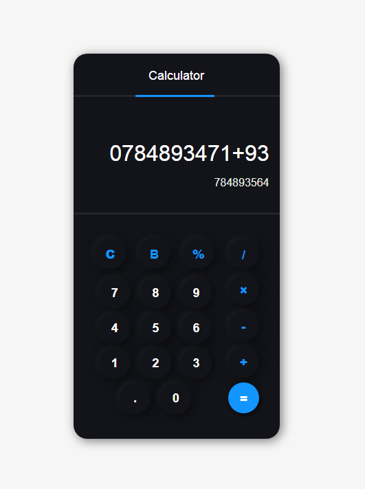

## Advanced JavaScript Calculator
This is an advanced JavaScript calculator with a user-friendly interface, designed to perform basic arithmetic operations. The calculator incorporates features such as history tracking and a responsive layout.

## Preview

## Contributing
If you'd like to contribute to the project, feel free to submit a pull request.
